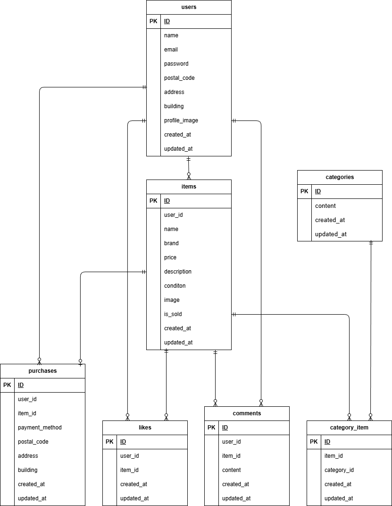

# coachtechフリマ

## 概要
Laravelを用いて開発したフリマアプリです。  
会員登録、商品出品、購入、コメント、Stripe決済機能を実装しています。

## 環境構築
### Dockerビルド

1. リポジトリをクローン
``` bash
git clone git@github.com:urbexsaku/flea-market-app.git
```
2. Docker Desktopを起動
3. コンテナを作成・起動
``` bash
docker-compose up -d --build
```


### Laravel環境構築
1. PHPコンテナへ入る
``` bash
docker-compose exec php bash
```
2. パッケージインストール
``` bash
composer install
```
3. .envファイルを作成
```
cp .env.example .env
```

4. .envに以下を設定
- DB設定
``` env
DB_CONNECTION=mysql
DB_HOST=mysql
DB_PORT=3306
DB_DATABASE=laravel_db
DB_USERNAME=laravel_user
DB_PASSWORD=laravel_pass
```

- Stripe設定
以下URLからStripeのAPIキーを取得し、.envに設定して下さい。

https://dashboard.stripe.com/test/apikeys
``` text
STRIPE_KEY=取得した公開キー（pk_test_XXXXXXX）
STRIPE_SECRET=取得したシークレットキー（sk_test_XXXXXXX）
```
- メール設定(MailHog)
MailHogを使用するため追加設定は不要です。

5. アプリケーションキーの作成
``` bash
php artisan key:generate
```

6. マイグレーションの実行
``` bash
php artisan migrate
```

7. シーディングの実行
``` bash
php artisan db:seed
```

### Laravel Dusk環境構築
1. Laravel Dusk をインストール
```bash
composer require --dev laravel/dusk
php artisan dusk:install
```
2.  .env.dusk.localファイルを作成
```
cp .env.dusk.example .env.dusk.local
```
3. .env.dusk.local に以下を設定

- DB設定
``` env
DB_CONNECTION=mysql
DB_HOST=mysql
DB_PORT=3306
DB_DATABASE=laravel_dusk
DB_USERNAME=laravel_user
DB_PASSWORD=laravel_pass
```
- APP_KEY
``` env
APP_KEY=.env の APP_KEY をここへコピー
```

## 使用技術(実行環境)
- PHP 8.1
- Laravel 8.75
- MySQL 8.0.26
- Nginx 1.21.1

## URL
- 開発環境：http://localhost/
- phpMyAdmin：http://localhost:8080/
- MailHog（メール認証確認）：http://localhost:8025/


## Stripe決済

カード支払いの確認にはStripeのテスト決済を使用しています。

- テストカード番号：4242 4242 4242 4242
- 有効期限：任意の未来日付
- セキュリティコード：任意の3桁

## テスト用アカウント

以下のユーザーでログインが可能です。

### 一般ユーザー

| 名前 | メールアドレス | パスワード |
|------|----------------|------------|
| 鈴木一郎 | ichiro@example.com | password |
| 山田太郎 | taro@example.com | password |
| 佐藤花子 | hanako@example.com | password |

- すべて同一パスワードでログインできます。
- 出品商品はランダムでユーザーに割り当てています。

## テスト実行方法

### PHPUnit
```bash
php artisan test
```

### Laravel Dusk
```bash
php artisan dusk
```
- 初期生成される  `ExampleTest.php`は本アプリでは使用しません。必要に応じて削除してください。
```bash
rm tests/Browser/ExampleTest.php
```

## ER図


## 追加実装機能
以下は、開発要件に記載のない追加実装機能です。

- 売却済み商品の「購入はこちら」ボタンを「売り切れ」と表示し、購入画面へ遷移できないように制御
- メール認証ページで認証メール再送後、「認証メールを再送信しました」とメッセージを表示